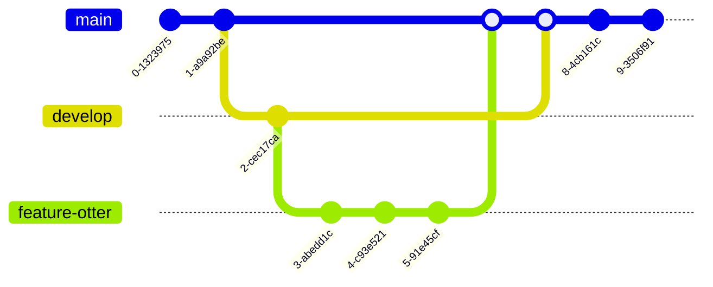

# MermaidJS Integration

Otter Docs integrates with [MermaidJS](https://mermaid-js.github.io/mermaid/#/) 

Checkout [Mermaid.Live](https://mermaid.live/) to create stylish diagrams like:

## Otter reproduction!

## Otter lifestyle

## One otter after the otter

## Otter class diagram

## OTTER ER-DIAGRAMS

## Otter Journey

## Otter git graph

